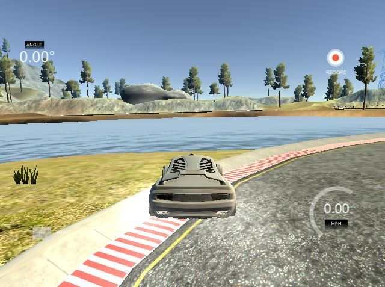

# **Behavioral Cloning**
---
**Behavioral Cloning Project**

The goals / steps of this project are the following:
* Use the simulator to collect data of good driving behavior
* Build, a convolution neural network in Keras that predicts steering angles from images
* Train and validate the model with a training and validation set
* Test that the model successfully drives around track one without leaving the road
* Summarize the results with a written report

## Rubric Points
---
#### Here I will consider the [rubric points](https://review.udacity.com/#!/rubrics/432/view) individually and describe how I addressed each point in my implementation.  

### Files Submitted & Code Quality

#### _1. Submission includes all required files and can be used to run the simulator in autonomous mode_

My project includes the following files:
* model.py containing the script to create and train the model
* drive.py for driving the car in autonomous mode
* model.h5 containing a trained convolution neural network 
* writeup_report.md or writeup_report.pdf summarizing the results

#### _2. Submission includes functional code_
Using the Udacity provided simulator and my drive.py file, the car can be driven autonomously around the track by executing 
```
python drive.py model.h5
```

#### _3. Submission code is usable and readable_

The model.py file contains the code for training and saving the convolution neural network. The file shows the pipeline I used for training and validating the model, and it contains comments to explain how the code works.

### Model Architecture and Training Strategy

#### 1. An appropriate model architecture has been employed

my model architecture is showing below:


you can see, the model is containing  5 layers of 2D convolutions, and 4 fully connected layer:

| Layer         		|     input size	        					|   output size |
|:---------------------:|:---------------------------------------------:|:-------:|
| Crooping2D((70,25),(0,0)) | 160*320*3 Normalized RGB image | 65*320*3 Normalized RGB image |
| Convolution2D 24x5x5 & stride 2x2 & RELU | 65x320x3 Normalized RGB image | 30x157x24 Normalized image |
| Convolution2D 36x5x5 & stride 2x2 & RELU | 30x157x24 Normalized image | 12x76x36 Normalized image |
| Convolution2D	48x5x5 & stride 2x2 & RELU | 12x76x36 Normalized image | 3x35x48 Normalized image |
| Convolution2D	64x3x3 & stride 1x1 & RELU | 3x35x48 Normalized image | 1x32x64 Normalized image |
| Convolution2D 64x3x3 & stride 1x1 & RELU | 1x32x64 Normalized image | 1x29x64 Normalized image |
| Flatten| 1x29x64 Normalized image | 1864 1D array |
| Fully Connected:Dense(100) | 1864 1D array |  100 1D array |
| Fully Connected:Dense(50)	| 100 1D array | 50 1D array |
| Fully Connected:Dense(10)	| 50 1D array  | 10 1D array |
| Fully Connected:Dense(1)	| 10 1D array | result |

#### 2. Attempts to reduce overfitting in the model

the shuffle triggle is ON for every epoch run, and also using validation split 20% from traning data which can see the validation loss from each run, if the validation loss is steadily reduce without oscillation, which means the model doesn't have overfitting
```
model.fit(combin_X_train, combin_y_train, validation_split=0.2, shuffle=True)  
```

#### 3. Model parameter tuning

The model used an adam optimizer, so the learning rate was not tuned manually, and also epoches equals to 10 give a pretty reasonable validation loss during training as well.
```
model.compile(loss='mse', optimizer='adam')
```

#### 4. Appropriate training data

By follwing the guidelines, first of all, 3 laps of running follwing the center line of track are made, then I drive the car out of track and drive it back on purpose, this is because more drive back data will let the model handle how to drive the car properly when the car is out of center line.

Beside of that, when I finish training model, I figure out the last big right trun curve still have issue that the car can't make right decision and keep going out of track, so I made two more laps and drive out and pull back on purpose just for this truning. 

### Model Architecture and Training Strategy

#### 1. Solution Design Approach

The overall strategy for deriving a model architecture was to based on the guidelines from LeNet network archteiture. Instead of using maxpooling, more convolution2D layers are used in this model, and adjust dense layer to give an good turning angle.

There is an issue when the first model is finished, the vehicle is keeping going straight at the last big right turning, to fix the issue, more data regarding to this turning has been generated, and new model is fixing this issue pretty good.

#### 2. Final Model Architecture

The final model architecture (model.py lines 18-24) consisted of a convolution neural network with the following layers and layer sizes 
```
model = Sequential()
model.add(Lambda(lambda x: x/255.0-0.5, input_shape=(160,320,3)))
model.add(Cropping2D(cropping=((70,25),(0,0))))

model.add(Convolution2D(24,5,5,subsample=(2,2),activation='relu'))
model.add(Convolution2D(36,5,5,subsample=(2,2),activation='relu'))
model.add(Convolution2D(48,5,5,subsample=(2,2),activation='relu'))
model.add(Convolution2D(64,3,3,activation='relu'))
model.add(Convolution2D(64,3,3,activation='relu'))

# model.add(MaxPooling2D())
model.add(Flatten())

model.add(Dense(100))
model.add(Dense(50))
model.add(Dense(10))
model.add(Dense(1))

model.compile(loss='mse', optimizer='adam')
model.fit(combin_X_train, combin_y_train, validation_split=0.2, shuffle=True)

model.save('model.h5')
```

#### 3. Creation of the Training Set & Training Process

first of all, 3 laps of running follwing the center line of track are made, 


then I drive the car out of track and drive it back on purpose, this is because more drive back data will let the model handle how to drive the car properly when the car is out of center line


Then, I drive the car follow the side line to generate the driving boundary.


Finally, for fixing the turning issue, I'm trying to solve the issue with old model by recording two more laps which is focusing on the last right turning 



then I concatentate data
```
### concatenate data
combin_X_train = np.concatenate((X_train, X_train1), axis=0)
combin_y_train = np.concatenate((y_train, y_train1), axis=0)
```

After the collection process, I had 7672 number of data points. 
I finally randomly shuffled the data set and put 20% of the data into a validation set. 

I used this training data for training the model. The validation set helped determine if the model was over or under fitting. The ideal number of epochs was 5 as evidenced by over 5 the validation loss will be various which means overfitting. I used an adam optimizer so that manually training the learning rate wasn't necessary. and final model has decent validation loss below:
```
Train on 7319 samples, validate on 1830 samples
Epoch 1/5
7319/7319 [==============================] - 85s 12ms/step - loss: 0.0427 - val_loss: 0.2529
Epoch 2/5
7319/7319 [==============================] - 85s 12ms/step - loss: 0.0369 - val_loss: 0.2576
Epoch 3/5
7319/7319 [==============================] - 88s 12ms/step - loss: 0.0334 - val_loss: 0.2362
Epoch 4/5
7319/7319 [==============================] - 88s 12ms/step - loss: 0.0306 - val_loss: 0.2466
Epoch 5/5
7319/7319 [==============================] - 83s 11ms/step - loss: 0.0296 - val_loss: 0.2556
```


